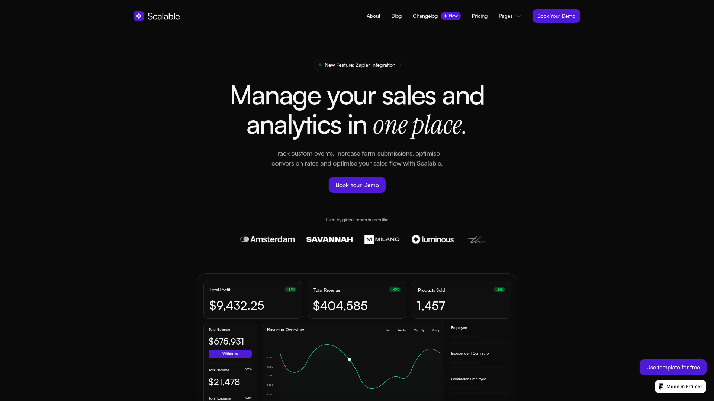

# DESIGN.md: Scalable (Framer template) — UI & Theme Reference

> **Scope note:** This file captures **visual language only** — color, type, spacing,
> component shape, and motion. All of the source site's *content* (its product copy,
> pricing figures, testimonial names, FAQ text, logo marquee/carousel) is deliberately
> excluded and must not be carried into Moni-Cheque. Moni-Cheque's own scenarios,
> misconception names, disclaimers, and dashboard fields are the content layer and are
> governed by the project brief's "preserve verbatim" rule.
>
> **Rights note:** This documents an observed visual language for reference. It does not
> convey any right to the source site's logo, wordmark, imagery, or copy. Do not reuse
> the "Scalable" name, mark, or any of its text.

## Status: reference record, not the live palette

This file is the record of the **reference site's** design language, captured by
scrape. Moni-Cheque now uses its **own brand palette**, so the colour section
below documents where the structure came from, not what the app renders.

| | Reference (this file) | Moni-Cheque (live) |
|---|---|---|
| Accent | `#6648FA` violet | `#2DE1FC` cyan |
| Positive | `#1AFF75` | `#2AFC98` |
| Ground | `#0A0A0A` neutral | `#060C0C` teal-tinted |
| Surface | `#0D0D0D` | `#0A1211` |

Everything else — the 500-weight-only rule, `-0.02em` tracking, the 14px body
default, the italic-serif heading accent, the hairline `box-shadow` ring, the
24px card radius, the fade+blur+rise reveal — carried over unchanged and is
still accurate.

**The live tokens are `src/index.css`.** That file is the source of truth for
colour; this one is the source of truth for structure.

## Source
- URL: https://scalable.framer.website/
- Capture date: 2026-08-25
- Evidence: Firecrawl `branding` + `images` scrape, viewport screenshot, full-page
  screenshot (1920×7925), raw HTML (992 KB) parsed for resolved CSS tokens
- Artifacts: `.firecrawl/scalable-branding.json`, `.firecrawl/scalable.html`,
  `.firecrawl/scalable-screenshot.png`, `.firecrawl/scalable-fullpage.png`

## Reference Screenshot



Full-page reference: `./.firecrawl/scalable-fullpage.png`

Use the screenshots as the source of truth for layout, density, and feel. Tokens below
describe the same page in machine-readable form.

## Design Summary

A **dark, near-black editorial SaaS** aesthetic. The whole page sits on pure `#0A0A0A`
with content raised on barely-lighter `#0D0D0D` cards separated from the background not
by borders but by a **1px white-at-10% ring** drawn with `box-shadow`. Type is almost
entirely **one weight (500 / medium)** with **tight negative tracking**, which is what
makes it read as designed rather than bolded. The signature move is a **display heading
in a geometric grotesque with the final phrase set in an italic serif** — a
sans/serif-italic pairing inside a single line. Accent color is used sparingly: one
violet for actions, one neon green reserved for positive-delta indicators. Sections are
separated by very generous vertical air, and everything below the fold arrives via a
**fade + blur + rise** scroll reveal.

---

## Design Tokens

### Colors

Values below are *observed* — extracted from resolved Framer token fallbacks in the
rendered HTML and ranked by usage count.

| Role | Value | Hex | Observed uses | Notes |
|---|---|---|---|---|
| `bg` (page) | `rgb(10, 10, 10)` | `#0A0A0A` | page canvas | The true page ground |
| `surface` (card) | `rgb(13, 13, 13)` | `#0D0D0D` | 42 | Raised card / panel |
| `surface-translucent` | `rgba(13, 13, 13, 0.4 / 0.5 / 0.8)` | — | 12 | Glass panels, paired with backdrop blur |
| `text-primary` | `rgb(255, 255, 255)` | `#FFFFFF` | 152 | Headings and high-emphasis text |
| `text-muted` | `rgb(171, 171, 171)` | `#ABABAB` | 139 | Body copy, subheads, eyebrows |
| `text-inverted` | `rgb(252, 252, 250)` | `#FCFCFA` | 140 | Warm off-white, used on light/inverted surfaces |
| `border-hairline` | `rgba(255, 255, 255, 0.1)` | — | 50 | The universal edge treatment |
| `accent-primary` | `rgb(102, 72, 250)` | `#6648FA` | 10 | Violet — buttons, active states, ambient glow |
| `accent-positive` | `rgb(26, 255, 117)` | `#1AFF75` | 7 | Neon green — deltas, status dots, chart line |
| `surface-light` | `rgb(249, 250, 251)` | `#F9FAFB` | 16 | Rare light-surface inversion |

**Correction against the automated branding block:** Firecrawl's `branding` output
reported `primary: #4F1AD6`, `textPrimary: #0A0A0A`, and `link: #0000EE`. Those are
wrong — `#0A0A0A` is the *background*, not text, and `#0000EE` is the browser's default
unstyled-link color. The table above is derived from the actual resolved CSS and
supersedes it. The real violet is `#6648FA`.

**Usage discipline (the important part):** violet and green together account for ~17 of
~440 color applications. This palette is ~96% monochrome. Do not spread the accents
around — one violet action per view, green only for genuinely positive quantitative
signal.

```css
:root {
  --bg:                #0A0A0A;
  --surface:           #0D0D0D;
  --surface-glass:     rgba(13, 13, 13, 0.4);
  --text-primary:      #FFFFFF;
  --text-muted:        #ABABAB;
  --text-inverted:     #FCFCFA;
  --border-hairline:   rgba(255, 255, 255, 0.1);
  --accent-primary:    #6648FA;
  --accent-positive:   #1AFF75;
}
```

### Typography

**Families (decoded from the site's `--font-selector` values):**

| Family | Weights observed | Role |
|---|---|---|
| **Satoshi** | 400, 500 | Primary — headings, UI, body |
| **Instrument Serif** | italic | Display accent only — the italic phrase inside headings |
| **DM Sans** | 400 | Secondary/support |
| Inter | 500 | Fallback/system |

Satoshi is not on Google Fonts (Fontshare). Instrument Serif and DM Sans are. A
practical stack:

```css
--font-sans:  "Satoshi", "DM Sans", ui-sans-serif, system-ui, sans-serif;
--font-serif: "Instrument Serif", ui-serif, Georgia, serif;  /* italic only */
```

**Weight is the signature.** 236 of 242 observed weight declarations are `500`. There is
essentially **no bold on this site.** Hierarchy comes from *size and color*, never from
weight. Using 600/700 anywhere will immediately break the look.

**Tracking is the second signature.** 191 of 208 declarations are `-0.02em`, tightening
to `-0.04em`/`-0.05em` at display sizes. Negative tracking at every size is non-optional.

**Type scale (observed sizes, by frequency):**

| Token | Size | Line height | Tracking | Use |
|---|---|---|---|---|
| `display` | 72px | 1.1em | -0.04em | Hero headline (desktop) |
| `h1` | 52px | 1.1em | -0.04em | Section headings |
| `h2` | 48px | 1.1em | -0.02em | Secondary headings |
| `h3` | 32px | 1.2em | -0.02em | Sub-section |
| `h4` | 24px | 1.2em | -0.02em | Card titles, large stats |
| `lg` | 20px | 1.4em | -0.02em | Lead paragraph |
| `md` | 18px | 1.4em | -0.02em | Feature card titles |
| `base` | 14px | 1.4em | -0.02em | **Body default** (69 uses — most common size on the page) |
| `sm` | 12px | 1.4em | -0.02em | Eyebrows, labels, meta (29 uses) |

Note the body default is **14px, not 16px** — this is a compact, dense-feeling text
system. Line height for all running text is `1.4em`; headings tighten to `1.1em`.

### Spacing, Radius, Shadow, Borders

- **Base unit: 4px.** Scale: `4 · 8 · 12 · 16 · 24 · 32 · 48 · 64 · 96 · 128`.
- **Observed gaps:** 16px (within cards), 32px (between cards/grid).
- **Section rhythm is very generous** — roughly 120–180px of vertical padding between
  major sections, with large empty runs between the visual and the next heading. The
  page is 7925px tall for ~9 sections. Do not compress this; the air is the design.
- **Container:** content column caps around 1100–1200px, centered, with the hero text
  block narrower (~700px) for a 2-line measure.

**Border radius (observed):**

| Radius | Uses | Applied to |
|---|---|---|
| `24px` | 44 | Cards, panels, feature tiles, large surfaces |
| `999px` | 39 | Pills — badges, eyebrow chips, avatars, toggles |
| `12px` | 19 | Primary buttons |
| `8px` | 17 | Small controls, nav items, icon chips |
| `50px` | 11 | Secondary/ghost pill buttons |

**Edges are drawn with `box-shadow`, not `border`.** This is the defining structural
technique — it keeps the 1px ring from affecting layout box size:

```css
/* universal hairline edge — 9 uses */
box-shadow: rgba(255, 255, 255, 0.1) 0px 0px 0px 1px;

/* primary button — violet-tinted ring + soft lift (8 uses) */
box-shadow:
  rgba(0, 0, 0, 0.05)      0px 4px 10px -2px,
  rgba(0, 0, 0, 0.1)       0px 2px 2px  -1px,
  rgba(102, 72, 250, 0.12) 0px 0px 0px  1px;

/* neon status glow — sparingly */
box-shadow: rgba(25, 255, 117, 0.8) 0px 0px 9.87px 0px;

/* elevated floating panel */
box-shadow:
  rgba(0, 0, 0, 0.17) 0px 0.6px  1.57px -1.5px,
  rgba(0, 0, 0, 0.14) 0px 2.29px 5.95px -3px,
  rgba(0, 0, 0, 0.02) 0px 10px   26px   -4.5px;
```

**Backdrop blur** is used heavily (`blur(10px)` × 23, `blur(5px)` × 6, `blur(24px)` × 3)
on translucent surfaces — the sticky nav and any overlay panel.

---

## Components

### Nav (sticky, glass)
Logo lockup left (rounded-square violet icon + wordmark). Center/right links at 14px/500
in `--text-muted`, hover to white. Links sit in 8px-radius hit targets with a
transparent background that fills to `rgba(255,255,255,0.04)` on hover. A small violet
pill badge can annotate a link (e.g. a "New" tag). Right end: one solid violet primary
button. Bar is `rgba(13,13,13,0.4)` + `backdrop-filter: blur(10px)`.

### Buttons
- **Primary:** violet `#6648FA` fill, white text, `border-radius: 12px`, padding ~12px
  20px, 14px/500 type, the violet-ring shadow above. Hover: slight brightness lift.
- **Secondary/ghost:** `#0B0B0B` fill, `border-radius: 50px`, white text, hairline ring
  `rgba(255,255,255,0.1) 0 0 0 1px`.
- Buttons are **compact** — they do not stretch full width on desktop.

### Eyebrow / status pill
A `999px` pill above section headings: `#0D0D0D` fill, hairline ring, 12px/500 muted
text, optional 6px colored dot (green for "live/new") at the left. This is the standard
section-label device and appears above nearly every section heading.

### Card (the workhorse)
`#0D0D0D` background, `24px` radius, hairline ring shadow, ~24–32px internal padding.
Feature variant: small monochrome icon top-left in an 8px-radius chip, then an 18px/500
white title, then 14px/500 `#ABABAB` body. Laid out 3-across on desktop with 32px gaps,
collapsing to 1-across on mobile.

### Stat tile
Small muted label (12px) top-left, a green delta pill (`#1AFF75` text on a dark green
translucent fill, `999px`) top-right, and a large 32–40px/500 white figure below. Used in
rows of three inside a bordered dashboard panel.

### Dashboard mock panel
An outer `24px`-radius panel with a hairline ring, containing nested inner cards at a
slightly smaller radius. Charts are drawn as a single thin `#1AFF75` line on a dark plot
with faint horizontal gridlines and small 10px axis labels. A violet ambient glow is
placed *behind* the panel to lift it off the page.

### Testimonial column
Three vertical columns of stacked cards, each card = 5 small star glyphs, a 14px quote,
then a 32px circular avatar with name (white) and role (muted) beside it. The column
group is masked at top and bottom so cards fade into the background:
```css
mask-image: linear-gradient(rgba(0,0,0,0) 0%, #000 10%, #000 90%, rgba(0,0,0,0) 100%);
```

### Accordion (FAQ)
Full-width rows, `#0D0D0D`, hairline ring, ~16px radius, 20px padding. Question at
14–16px/500 white, `+` / `−` glyph right-aligned. Expanded state reveals 14px/500 muted
body and the row background stays the same — only height animates.

### Toggle (segmented)
A `999px` pill container holding two options; the active one gets a violet fill that
slides between positions. An optional small muted tag sits outside the pill.

### Footer
Centered logo lockup, a final display heading with the italic-serif accent, a short
muted 2-line paragraph, one primary button — then a thin bottom row with small muted
links left and an attribution right.

---

## Page Patterns

**Section header formula** (used almost every time):
1. centered eyebrow pill
2. centered display heading, **last 1–2 words in italic serif**
3. centered 2-line muted subhead at ~14–16px
4. generous gap, then the section content

**Section order on the reference page:**
hero → *(logo marquee — excluded)* → dashboard mock → testimonial columns → split
feature (text left / visual right) → split feature (visual left / text right) → feature
grid (3×2) → pricing → FAQ accordion → closing CTA → footer.

**Split sections alternate sides.** Text half: eyebrow pill, italic-accent heading,
3-line muted paragraph, primary button. Visual half: a dark card mock with a violet
ambient glow behind it.

**Responsive assumptions:** desktop 3-col grids → 1-col on mobile; hero display drops
from 72px to roughly 40–44px; split sections stack text-above-visual; section vertical
padding roughly halves.

---

## Motion

Observed: `will-change: transform` on 285 elements, `filter: blur(0px)` on 25 (settled
states of a blur-in), 44 translate transforms, 16 `opacity: 0` initial states.

**The scroll reveal** is the site's one repeated animation — elements enter with:

```css
/* initial */  opacity: 0; transform: translateY(20px); filter: blur(6px);
/* settled */  opacity: 1; transform: translateY(0);    filter: blur(0px);
/* ~0.6s, ease-out, staggered ~60–80ms across siblings, fires once on enter */
```

Everything else is restrained: 150–200ms ease hover transitions on buttons/links, a
sliding fill on the segmented toggle, height animation on the accordion. No parallax, no
looping background effects, nothing decorative.

Respect `prefers-reduced-motion: reduce` by dropping straight to the settled state.

---

## Agent Build Instructions

To build a new interface in this language:

1. Set the page to `#0A0A0A`. Every panel is `#0D0D0D` at `24px` radius, separated from
   the ground **only** by `box-shadow: rgba(255,255,255,0.1) 0 0 0 1px`. Never use a
   `border` for this and never use a mid-gray fill.
2. Load Satoshi (or DM Sans as substitute) and Instrument Serif. Set **every** text
   element to weight 500 and `letter-spacing: -0.02em` by default; tighten to `-0.04em`
   above 48px. Do not use 600 or 700 anywhere.
3. Body text is 14px at `line-height: 1.4em` in `#ABABAB`. White is reserved for
   headings and high-emphasis figures. Two text colors, that's it.
4. For each display heading, set the closing 1–2 words in `Instrument Serif` *italic* at
   the same size. This single pairing carries most of the site's character — if it's
   missing, the design reads as generic dark-mode.
5. One violet `#6648FA` action per view, at `12px` radius with the violet-ring shadow.
   Green `#1AFF75` **only** for positive quantitative signal (deltas, live dots, chart
   lines) — never as decoration.
6. Precede each section with a `999px` eyebrow pill and center the heading block. Leave
   120–180px of vertical padding between sections; the emptiness is load-bearing.
7. Apply the fade+blur+rise reveal on scroll with a short stagger. Nothing else moves.
8. Glass (`rgba(13,13,13,0.4)` + `blur(10px)`) is for the sticky nav and overlays only.

**Anti-patterns that break this look:** bold weights; default (0) letter-spacing; 16px
body; gray `#1a1a1a`–`#333` card fills; visible 1px solid borders; multiple accent
colors; gradient text; drop shadows dark enough to see; tight section padding.

---

## Rerun Inputs
```
workflow: firecrawl-website-design-clone
source_url: https://scalable.framer.website/
target_stack: TBD — pending Moni-Cheque stack decision
output: DESIGN.md
excluded: logo marquee/carousel, all source-site marketing copy and content
```
